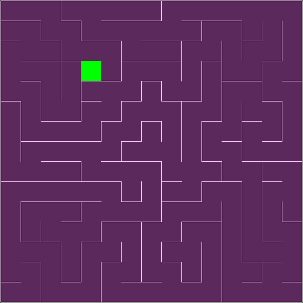

# Maze Generation Using Depth First Search Recursive Backtracking.

Project Completed in the partial fulfillment of Mini Project of Course Code COMP 342 (Computer Graphics) in Kathmandu Univeristy.  Project Supervisor: Dheeraj Shrestha Sir

